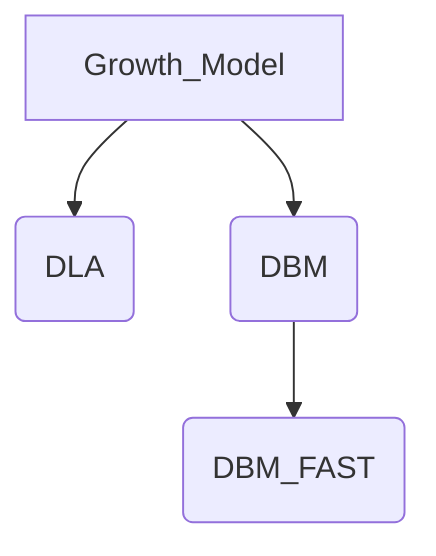

# Report11

> 计算物理 作业十一
>
> PB20020480 王润泽

## 1. Question

​	模拟2维DLA以及介电击穿（DBM）图案并讨论

## 2. Algorithm

### 2.1 DLA

​	DLA：扩散受限聚集模型（Diffusion Limited Aggregation）

##### 模拟规则：

​	取一个2维的方形点阵，在点阵中央原点处放置一个粒子作为生长的种子，然后从距原点足够远的圆周界处释放一 个粒子，让它作随机行走，其结果是：该粒子走到种子的最近邻位置与种子相碰， 这时让粒子粘结到种子上不再运动；当粒子走到点阵边界，这时认为粒子走了一条无用的轨迹，取消该粒子，重新生成新的粒子。因此， 那些有用的粒子与种子相粘结后形成不断生长的聚集集团。

##### 定义

- 当前聚集集团最远点距离为 **d** 
- 集团半径$r = \max{\{20, d\}}$ 
- 二维方矩阵边长为 $N$
- 粒子黏度 $stickness\in(0,1)$
- 生成圆半径 $R=2r$

##### 算法

1. 随机生成生成一个粒子 $x$

   - 若 $R<N/2$，则在半径为 $R$的圆上，随机生成一个粒子

   - 否则，在方形点阵的边界上随机生成一个粒子
2. 让粒子 $x$随机行走，判断周围8个点是否有粒子集团
   - 若碰到点阵边界，则返回1，重新生成一个粒子

   - 若附近有集团粒子，依据x黏度 **`stickness`**判断是加入集团还是继续随机行走
3. 当粒子加入集团，更新集团半径 $r$。
4. 返回1；或当集团足够大时，程序结束。

### 2.2 DBM

​	DBM：介电击穿模型（The Dielectric Breakdown Model）

##### 模型规则

​	该模型所描述的过程是对于介电物质（绝缘体）中央点有一恒定电势 $\phi_0$，不断得击穿周围介质，使得形成增长导体。

​	击穿介质的生长速率 $v$ 是电势 $\phi$ 梯度的函数，即$v=f(\nabla_n\phi)$ ，n垂直于图形界面。而整个介质电势服从于 Laplace 方程式，此时的边界条件是，在已被占据的格子上 $\phi=\phi_0$ ，在远处 $\phi=0$。而生长模式是以生长速率为概率占据格子周界上的一个空格子。数学化描述即：
$$
生长速率:v_{i,j}=n|\phi_0-\phi_{i,j}|^{\eta}\tag{1}
$$
$$
选择概率:p_{i,j}=v_{i,j}/\sum v_{i,j}\tag{2}
$$

​	求和遍历周界上所有可以被占据的空格子，根据该几率随机选择一个格子进行占据。占据一个新格点后，边界条件发生改变，要重新计算电势分布，生长速率，选择概率。

##### 定义

- 格点状态：**`EMPTY`**自由点，**`CANDIDATE`**候选点，**`FILLED`**已生长的点
- 粒子集合 **`_particle_set`**:存放已经生成的点集合，其状态都为 **`FILLED`**
- 候选点集合 **`_candidate_set`**:存放待生长的候选点集合，其状态都为 **`CANDIDATE`**

##### 算法

1. 依照公式 （1）（2），以候选点的生长速率为概率，从 **`_candidate_set`**中随机选择一个候选点**x**
2. 将候选点**x**加入**`_particle_set`**，其状态从 **`CANDIDATE`**变为 **`FILLED`**，其电势变为 $\phi_0$
3. 将候选点 **x** 周围 **`EMPTY`** 加入 **`_candidate_set`**,状态从 **`EMPTY`**变为 **`CANDIDATE`**
4. 将 **x**从 **`_candidate_set`**中删去。
5. 依Laplace方程和新的边界条件重新计算 **`_candidate_set`**中粒子的电势；
6. 返回1；或当集团足够大时，程序结束

**注：**实际代码实现时，可以不对点进行状态标记，而是依照点是否在 **`_particle_set`**或 **`_candidate`** 中判断其状态。

**Laplace方程数值解法：**

​	Laplace方程形式为
$$
\nabla^2\phi(x,y)=0,\phi|_{\part D}=f(x,y)
$$
​	对于数值解，可以写成
$$
\phi_{i,j}=(\phi_{i-1,j}+\phi_{i+1,j}+\phi_{i,j-1}+\phi_{i,j+1})/4
$$
​	实际情况是，并不知道周围电势大小，只知道边界的电势，故让处于(i , j)的粒子随机游走，遇到边界时停下，记下边界 $f(x,y)$，在多次随机游走后取平均，得到电势平均值，为(i , j)点的电势
$$
\left<\phi_{i,j}\right>=\frac1N\sum_n^N f_n(x,y)
$$

### 2.3 DBM_FAST

##### 背景

​	对于实际介电击穿模型，算法的主要瓶颈是在每次迭代后，要重新计算**所有候选点** 的电势大小，当边界范围**N**取得足够大时，生长**n**个点，所需的时间复杂度为 $O(n*N^3)$ [1](#refer-anchor-1),这对于 $N=300$为边长的网格点来说，时间将非常慢，生长 $n=300$个点，大约需要18分钟左右。

​	故我参照一篇关于 **快速Laplace生长模拟** [1](#refer-anchor-1)的论文思路，提出以下改进。

##### 思路

​	将每个“生长”出的点，进行绝缘体包裹，即电荷不重新分布，而是固定在格点处。对于候选点电势，即是这些已经 **`FILLED`**的生长点电荷电势的线性叠加。

​	考虑，边界为中心电势为1，无限远电势为0，那么可以把每个点电荷当作正电荷处理，电势为
$$
\phi(r)=\frac{R_1}{r}
$$
​	其中，设每个小格点边长为 $h$，点电荷半径为 $R_1=h/2$

​	那么对于 **`CADIDATE`**的点 $i$ ,其电势为所有**`FILLED`**点电荷 $j$的叠加
$$
\phi_i=\sum_{j=1}^n\frac{R_1}{r_{i,j}}\tag{3}
$$
​	而生长速率也要进行相应的修正，设 `candidate`的最大电势为 $\phi_{max}$，最小电势为 $\phi_{min}$
$$
v_i = \left(\frac{\phi_{max}-\phi}{\phi_{max}-\phi_{min}}\right)^{\eta}\tag{4}
$$
​	之所以可以加速，是因为每次迭代时，可以利用以前的电势进行迭代，即
$$
\phi^{t+1}=\phi^{t}+\frac{R_1}{r_{i,t+1}}\tag{5}
$$
​	$r_{t+1}$是新加入 `FILLED`的新点位置与各个 `CANDIDATE` 点的的距离

##### 算法

1. 依照公式（4）候选点的生长速率为概率，归一化后，从 **`_candidate_set`**中随机选择一个候选点**x**
2. 将候选点**x**加入**`_particle_set`**，其状态从 **`CANDIDATE`**变为 **`FILLED`**
3. 将 **x**从 **`_candidate_set`**中删去
4. 根据公式（5），迭代 **`_candidate_set`**中的电势
5. 将 **x** 周围 **`EMPTY`** 加入 **`_candidate_set`**,状态从 **`EMPTY`**变为 **`CANDIDATE`**，依照公式 （3） 计算新候选点的电势，一次迭代中这样的点不超过5个
6. 返回1；或当集团足够大时，程序结束

### 2.4 Code Framework

​	由于代码中涉及到大量查找点是否在集合中的操作，考虑效率的原因，选择了 `set`为主要数据结构，其查找 `in`，添加 `add`，删除 `remove`的操作都是 $0(1)$的时间复杂度。

​	由于三种生长模型思路相似，设计了类的继承框架。

​	下层的类继承上层类的接口，减少了代码重复的操作

## 3. Experiment

### 3.1 DLA

如下图所示，考虑了黏度分别为 **0.01,0.1,0.5,1**的DLA模型，生长了3000个点

    
    

    
    

图1 DLA不同stickness的对比（3000点）

##### DLA分析：	

​	由图可见，随着黏度的提高，DLA生长的图像会愈发稀疏，当黏度为1时，粒子进入一个沟槽之前，很有可能碰上一根在外的触须，因而粒子无法进入沟槽内，形成屏蔽效应。这一结构反映出生长过程的特征，即越是尖端处生长得越快，从而形成枝蔓向外延伸，越是平坦处生长得越慢，从而出现沟槽中的空隙疏松结构。这样的形貌只有当粒子粘结到集团而无任何优先选择的方向时才会出现

### 3.2 DBM

​	如下图所示，考虑了eta分别为 **0，3，6，10** 的DBM模型，由于代码效率受限，只生长了300个点

    
    

    
    

图2 DBM不同eta的对比（300点）

##### DBM分析：	

​	由图像可见，随着 $\eta$ 的增大，根据生长速率 $v_{i,j}=n|\phi_0-\phi_{i,j}|^{\eta}\tag{1}$为概率而选择，会导致图像的分支逐渐变少，图像从平面的二维均匀平面逐渐收敛到一维图像，如同从球状闪电到线状闪电一样。

​	通过分析也可以很容易解释上面的图像，当 $\eta$ 变大时，对于较大的势能梯度 $|\phi_0-\phi_{i,j}|$，其比重会更加明显，从而导致依概率选择时，更倾向于选择梯度变化更大的方向，故更容易呈现出分支较少的线形图像。

### 3.3 DBM_FAST

​	改善了算法后，得到eta分别为 **0，3，6，10** 的DLA模型，生长3000个点，有以下图像

    
    

    
    

图3 DBM FAST算法不同eta的对比（3000个点）

​	

##### DBM FAST分析：	

​	由图像可见，随着 $\eta$ 的增大，图像也同样得从二维的平面逐渐收敛到一维的线性，和DBM的趋势一致，从而可以说明，我们改善后的算法没有改变图像的本质区别，并且大大加速了算法的速度。

##### 与DBM 对比

下图是300个点的DBM FAST算法

    
    

    
    

图3 DBM FAST算法不同eta的对比（300个点）

可以更好的与DBM图像对比，二者几乎一致。

并且时间得到加速

几乎加快了1000倍

##### 与DLA对比

二者在一定参数选择下都呈现出树状生长的形状。

可以看到，DLA算法始终保持了较多的分支数目，不会随着参数的改变，而逐渐收敛到一维。DBM算法，会随着 $\eta$ 的改变，点与点相关性会变得明显，收敛到一维而不再保持分支现象。

## 4. Summary

​	本次实验对DLA和DBM模型进行对比，分析二者的不同。

​	提出了加速Laplace数值算法的方式，并通过实验验证其有效性。

​	在实验过程中，采取了良好的数据结构模式 **集合set**，提高了程序速度。

## 5. Reference

[1] [快速Laplace生长模拟](http://gamma.cs.unc.edu/FRAC/laplacian_large.pdf)